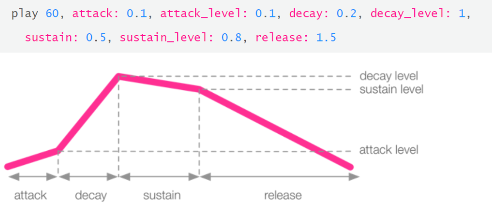

I got the USB keyboard I needed from my dad's today, plugged it into the Pi, spammed the Shift key during boot, and the recovery menu came right up.

When Raspbian was done installing, Sonic Pi launched no problem. Since I had the keyboard, I didn't have to enable SSH, or mess with any configuration.

I did try for a little to get the Bluetooth headphones to work, but after Googling some more, it seems like this is a common issue. I'm considering buying an aux-to-Bluetooth adapter, to see if that allows me to work around the limitation.

So as far as the setup goes, I'm happy with it for now. I would really like to be able to use my phone as a display, but I don't want to go down a configuration rabbit hole. I want to get through the [Sonic Pi Tutorial](https://sonic-pi.net/tutorial.html) so that I can actually start putting together some cool music.

Speaking of Sonic Pi, I definitely discovered a lot of cool features with it today:

- ASDR envelopes
  - `attack`: duration of the fade-in
  - `attack_level`: amplitude of the fade-in
  - `decay`: period between `attack` and sustain. can be adjusted separately
  - `decay_level`: amplitude of the `decay`
  - `sustain`: the main duration. can be implicit or explicit
  - `sustain_level`: amplitude of the `sustain` period
  - `release`: the time allotted to fade out the synth or sample

- With synths, the duration of each sound is the sum of `attack`, `decay`, `sustain`, and `release`
- Samples differ from synths, in that they have a set duration
  - This leads to an 'auto sustain' effect (or implied `sustain` value)
  - You can explicitly set a `sustain` value on a sample to shorten its duration
- `start` and `finish` options can be set on samples to play a clip of the sample
- Placing the `finish` option before the `start` option will play the sample backwards
- `print sample_duration :sample_name` will output the length of the sample to the console
  - Knowing this value can help you structure and layer your music
- The `rate` option behaves much like a spring
  - Doubling the rate plays the sample twice as fast, and at an octave higher
  - Halving the rate stretches the duration to double its length, and lowers the pitch by an octave
- External samples can be brought in, and manipulated with the same options as the out-of-the-box samples

I'm excited to start using synths, samples, and ASDR envelopes with loops. I'm also curious to see whether Sonic Pi allows for variables to be used, so that durations can manipulated more cleanly.

If variables are not supported (I have a feeling they are), I may look into using [python-sonic](https://pypi.org/project/python-sonic/), so that I can integrate Sonic Pi into straight-up Python code, instead of having to go through the Sonic Pi client.

I think I may create a Soundcloud account so that I can save and share my exercises and experimental code online.
